## Skill #2: Data Architecture Decision-Making
---
What This Means
Selecting the appropriate Epic data tier (Chronicles vs. Clarity vs. Caboodle) based on latency requirements, query complexity, and integration patterns.
Why Hiring Managers Value This Skill
This distinguishes experienced consultants from junior resources:

Junior consultant: "I'll build the dashboard in Clarity SQL"
Senior consultant: "For real-time alerts we need Chronicles FHIR APIs; for historical trending we use Clarity; for population registry submission we use Caboodle dimensional model."

Worked Example: Echo Lab Dashboard Redesign
Problem Statement: Cardiology leadership wants to monitor echo lab productivity in real-time during business hours.
Consultant's Thought Process:

```mermaid
%%{init: {'theme':'base', 'themeVariables': { 'primaryColor':'#2E7D32','primaryTextColor':'#FFFFFF','primaryBorderColor':'#1B5E20','lineColor':'#F57C00','secondaryColor':'#C62828','tertiaryColor':'#0277BD','noteBkgColor':'#FFF9C4','noteTextColor':'#000000','textColor':'#FFFFFF','fontSize':'16px','fontFamily':'Arial'}}}%%

graph TB
    User["👤 Supervisor<br/>Dashboard User"]
    Dashboard["📊 Web Dashboard<br/>(React/Vue)"]
    FHIR["🔌 FHIR API<br/>Procedure Endpoint"]
    Chronicles["⚡ Chronicles Database<br/>(Real-time Clinical Data)"]
    
    User -->|"Views current shift"| Dashboard
    Dashboard -->|"GET /Procedure?<br/>date=today&<br/>status=in-progress"| FHIR
    FHIR -->|"Queries real-time data"| Chronicles
    Chronicles -->|"Returns:<br/>• Study count<br/>• Average time<br/>• Current status"| FHIR
    FHIR -->|"JSON response"| Dashboard
    Dashboard -->|"Displays live metrics"| User
    
    style User fill:#1976D2,stroke:#0D47A1,stroke-width:4px,color:#FFFFFF
    style Dashboard fill:#388E3C,stroke:#1B5E20,stroke-width:4px,color:#FFFFFF
    style FHIR fill:#D32F2F,stroke:#B71C1C,stroke-width:4px,color:#FFFFFF
    style Chronicles fill:#F57C00,stroke:#E65100,stroke-width:4px,color:#FFFFFF
```

```mermaid
%%{init: {'theme':'base', 'themeVariables': { 'primaryColor':'#0277BD','primaryTextColor':'#FFFFFF','primaryBorderColor':'#01579B','lineColor':'#D84315','fontSize':'16px'}}}%%

flowchart TD
    subgraph User_Layer["👤 User Layer"]
        Supervisor["Supervisor<br/>Monitoring Dashboard"]
    end
    
    subgraph Application_Layer["🌐 Application Layer"]
        WebApp["Web Application<br/>(React/Vue)"]
        API["FHIR API Gateway"]
    end
    
    subgraph Data_Layer["💾 Data Layer"]
        Chronicles["Chronicles DB<br/>⚡ Real-time"]
        Clarity["Clarity DB<br/>📊 Reporting Only"]
    end
    
    Supervisor -->|"Accesses"| WebApp
    WebApp -->|"REST Call"| API
    API -->|"Live Query"| Chronicles
    API -.->|"❌ Bypassed<br/>(too slow)"| Clarity
    Chronicles -->|"Results"| API
    API -->|"JSON"| WebApp
    WebApp -->|"Display"| Supervisor
    
    style Supervisor fill:#1976D2,stroke:#0D47A1,stroke-width:4px,color:#FFFFFF
    style WebApp fill:#388E3C,stroke:#1B5E20,stroke-width:4px,color:#FFFFFF
    style API fill:#D32F2F,stroke:#B71C1C,stroke-width:4px,color:#FFFFFF
    style Chronicles fill:#F57C00,stroke:#E65100,stroke-width:4px,color:#FFFFFF
    style Clarity fill:#616161,stroke:#424242,stroke-width:3px,color:#FFFFFF,stroke-dasharray: 5 5
    
    style User_Layer fill:#E3F2FD,stroke:#1976D2,stroke-width:3px,color:#000000
    style Application_Layer fill:#FFF3E0,stroke:#F57C00,stroke-width:3px,color:#000000
    style Data_Layer fill:#E8F5E9,stroke:#388E3C,stroke-width:3px,color:#000000
```

## Diagram Overview

The diagrams above illustrate the real-time data flow architecture for a supervisor dashboard system that monitors clinical procedures. They demonstrate how live operational data is accessed and displayed to healthcare supervisors.

### Key Components

### 1. 👤 User Layer

**Supervisor/Dashboard User:** The end-user who monitors current shift activities, study counts, and procedure statuses in real-time through a web interface.

### 2. 🖥️ Frontend Layer

**Web Dashboard (React/Vue):** The user-facing application that displays live metrics and provides an interactive interface for monitoring procedures. Updates dynamically as new data becomes available.

### 3. 🌐 Integration/API Layer

**FHIR API Server:** Serves as the integration middleware using the Procedure resource endpoint. Handles REST API calls and translates requests between the frontend and backend databases.

**OAuth 2.0 Authentication:** Provides secure access control, ensuring only authorized users can access real-time clinical data.

### 4. 💾 Data Layer

**Chronicles Database (⚡ Real-time):** The operational database that stores live clinical data with immediate updates. This is the primary data source for the dashboard, providing sub-second response times.

**Clarity Database (❌ Not Used):** A reporting database with a 24-hour data delay. Explicitly bypassed for real-time monitoring due to latency issues, though it may be used for historical reporting and analytics.

### Data Flow Process

1. Supervisor accesses the web dashboard
2. Dashboard sends authenticated request through OAuth 2.0
3. FHIR API receives the request and queries Chronicles database
4. Chronicles returns real-time data (study count, average time, current status)
5. FHIR API formats response as JSON
6. Dashboard displays live metrics to the supervisor

**Key Design Decision:** The architecture prioritizes Chronicles over Clarity specifically to achieve real-time performance, as Clarity's 24-hour delay makes it unsuitable for operational monitoring.
---

Resulting Dashboard Architecture:

```mermaid
graph TB
    A["📊 Epic Chronicles<br/>EMR System"] -->|"FHIR API<br/>Procedure Resource"| B["⚙️ Dashboard<br/>Backend Engine"]
    B -->|"Auto-refresh<br/>every 30 sec"| C["📺 Real-Time<br/>Display Monitor"]
    C -->|"Live Status<br/>Updates"| D["👥 Supervisor<br/>Control Panel"]
    
    style A fill:#D90429,stroke:#8D0801,stroke-width:5px,color:#FFFFFF,font-weight:bold
    style B fill:#00B4D8,stroke:#023E8A,stroke-width:5px,color:#FFFFFF,font-weight:bold
    style C fill:#FFB703,stroke:#C17900,stroke-width:5px,color:#000000,font-weight:bold
    style D fill:#06D6A0,stroke:#028A5E,stroke-width:5px,color:#000000,font-weight:bold
```

