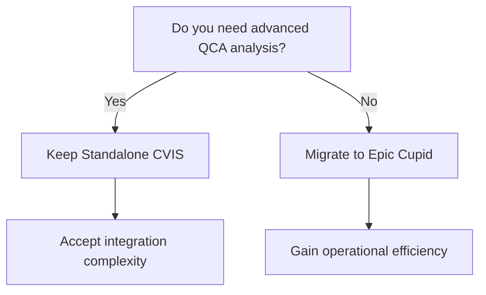

## Practical Application: Case Study Analysis
Real-World Situation: Epic Implementation at Mid-Size Cardiology Service
Organization Profile:

250-bed health system
15 cardiologists, 8 interventional cardiologists
Existing standalone CVIS (ScImage PICOM)
Planning Epic EHR + new Epic Cupid implementation
CathLab: 3 labs performing ~2,000 cases/year
Echo Lab: 4,000 studies/year
Goal: Unified cardiology workflow + NCDR registry automation

Pre-Implementation Decision: Keep Existing CVIS or Migrate to Epic Cupid Native?

## Consultant Analysis:
# 🏥 CVIS vs Epic Cupid: Decision Matrix

## 📊 Feature Comparison

| 🔍 **Consideration** | 🔵 **Keep Standalone CVIS** | 🟢 **Migrate to Epic Cupid Only** |
|:---------------------|:----------------------------|:----------------------------------|
| **🔗 Data Integration** | ⚠️ Requires HL7 bridges; nightly data sync to Epic | ✅ Single Chronicles database; real-time access |
| **📈 Specialized Reporting** | ✅ CVIS excels at granular QCA, ventriculography analysis | ⚠️ Cupid adequate for most; may lose QCA precision |
| **📋 Registry Submission** | ✅ CVIS vendor can extract CathPCI data | ⚠️ Must validate Cupid-to-registry mapping |
| **👨‍⚕️ Cardiologist Training** | ⚠️ Two systems to learn; context-switching | ✅ One system; simpler workflow |
| **💰 Integration Cost** | ⚠️ Interface development + vendor coordination | ✅ Eliminate third-party CVIS licensing |
| **🔮 Future Flexibility** | ⚠️ Locked into CVIS vendor roadmap | ✅ Epic ecosystem flexibility |

---

## 💡 Key Insights

### 🟢 **Epic Cupid Advantages**
- ✅ Seamless data integration
- ✅ Simplified training & workflow
- ✅ Cost reduction (eliminate third-party licensing)
- ✅ Future-proof Epic ecosystem flexibility

### 🔵 **Standalone CVIS Advantages**
- ✅ Advanced QCA reporting capabilities
- ✅ Established registry workflows
- ✅ Specialized ventriculography analysis

---

## 🎯 Decision Framework

---

## 📌 Recommendation

**If advanced QCA analysis is mission-critical** → Keep Standalone CVIS  
**Otherwise** → Epic Cupid offers significant operational advantages

---

*Last Updated: November 2025*

## Recommendation: Hybrid approach (Epic Cupid + Standalone CVIS)
Rationale:
