## Reflection & Critical Insights
What This Architecture Reveals About Healthcare IT
Insight 1: "Integrated" Doesn't Mean "Unified"
The term "Epic EHR" implies total integration, but real cardiology deployments are always hybrid:

Epic for clinical workflow & EMR integration
Specialized CVIS for advanced analysis
Standalone PACS for imaging storage
Registry vendors for quality/outcomes reporting

The consultant's job is designing integration strategies that make this hybrid system feel unified to cardiologists.
Insight 2: Standards Are More Powerful Than Vendor Features
HL7, FHIR, DICOM, and IHE exist precisely because no single vendor can optimize for every specialty.
A cardiologist using Epic benefits from:

HL7 interfaces enabling communication with echo vendors
FHIR APIs enabling modern mobile applications
DICOM standards enabling image transfer from any modality
IHE profiles ensuring clinical workflows are tested/documented

A consultant fluent in these standards can architect solutions that are:

Vendor-agnostic (don't lock customer into single vendor)
Future-proof (standards evolve; vendor products don't)
Sustainable (easier to maintain than proprietary integrations)

## Insight 3: The Database Tier Decision Is About Patient Safety
Choosing between Chronicles (real-time) and Clarity (next-day) isn't just technical—it's clinical:
---

```mermaid
graph TB
    subgraph Layer1["🔬 CRITICAL RESULT DETECTION"]
        A1["Critical Potassium Result Detected"]
    end
    
    subgraph Layer2["⚡ REAL-TIME ALERT SYSTEM"]
        A2["Chronicles/FHIR Alert Triggered"]
    end
    
    subgraph Layer3["👨‍⚕️ IMMEDIATE CLINICAL RESPONSE"]
        A3["Cardiologist Notified Instantly"]
    end
    
    subgraph Layer4["💊 SAME-VISIT INTERVENTION"]
        A4["Medication Adjustment Made"]
    end
    
    subgraph Layer5["✅ OUTCOME"]
        A5["Arrhythmia Risk Prevented"]
    end
    
    subgraph Layer6["📊 NEXT-DAY REPORTING"]
        B1["Clarity SQL Dashboard Generated"]
    end
    
    subgraph Layer7["📈 PERFORMANCE METRICS"]
        B2["Yesterday's Echo Lab Metrics"]
    end
    
    subgraph Layer8["👔 MANAGEMENT REVIEW"]
        B3["Leadership Analysis & Planning"]
    end
    
    A1 --> A2
    A2 --> A3
    A3 --> A4
    A4 --> A5
    
    A1 --> B1
    B1 --> B2
    B2 --> B3
    
    style Layer1 fill:#8B0000,stroke:#600000,stroke-width:4px,color:#fff
    style Layer2 fill:#DC143C,stroke:#8B0000,stroke-width:4px,color:#fff
    style Layer3 fill:#FF4500,stroke:#DC143C,stroke-width:4px,color:#fff
    style Layer4 fill:#FF6347,stroke:#FF4500,stroke-width:4px,color:#fff
    style Layer5 fill:#32CD32,stroke:#228B22,stroke-width:4px,color:#fff
    style Layer6 fill:#4169E1,stroke:#00008B,stroke-width:4px,color:#fff
    style Layer7 fill:#1E90FF,stroke:#4169E1,stroke-width:4px,color:#fff
    style Layer8 fill:#87CEEB,stroke:#1E90FF,stroke-width:4px,color:#000
    
    style A1 fill:#fff,stroke:#8B0000,stroke-width:2px
    style A2 fill:#fff,stroke:#DC143C,stroke-width:2px
    style A3 fill:#fff,stroke:#FF4500,stroke-width:2px
    style A4 fill:#fff,stroke:#FF6347,stroke-width:2px
    style A5 fill:#fff,stroke:#32CD32,stroke-width:2px
    style B1 fill:#fff,stroke:#4169E1,stroke-width:2px
    style B2 fill:#fff,stroke:#1E90FF,stroke-width:2px
    style B3 fill:#fff,stroke:#87CEEB,stroke-width:2px
```

A consultant who conflates these two—building real-time alerts on next-day data—creates a false sense of safety that endangers patients.
Personal Reflection: Translating 22 Years of Clinical Experience
As a 22-year cardiovascular lab manager, your clinical expertise is invaluable for this work:
You already understand:

How cath labs actually operate (not how they appear in textbooks)
Why cardiologists make specific demands about data availability
Where quality/safety gaps exist in current cardiology workflows
What "good" cardiology IT looks like (you've lived the consequences of bad implementations)

Your transition to consulting leverages this by:

Asking clinically-informed questions during requirements gathering
Recognizing when a vendor promises something technically infeasible
Designing solutions that respect cardiologist workflows, not reshape them
Gaining credibility with cardiologists who recognize you understand their world

The architecture knowledge you're building now:

Explains why your clinical insights matter technically
Provides the vocabulary to translate clinical needs to technical teams
Enables you to architect sustainable solutions, not quick fixes
