# 🎯 Knowledge Check: Application-Based Questions

---

## 📊 **Q1: Scenario-Based Analysis**

### 🏥 **Situation:**
A health system has Epic EHR + standalone CVIS. Cardiologists complain: 
> *"I order an echo in Epic, but results don't appear for 6 hours."*

### ❓ **What tier likely failed?**

- 🔵 **A)** Chronicles
- 🟢 **B)** Clarity  
- 🟡 **C)** Neither (interface issue)

### 💡 **Consultant Analysis:**
If results appear *eventually* (even if delayed), Chronicles is working. The 6-hour delay suggests the HL7 ORU^R01 message from CVIS isn't being processed quickly, OR the interface is queued for batching. This is a **data integration/interface issue**, not a Chronicles problem. 

✅ **Answer: C**

---

## ⚡ **Q2: Data Latency Decision**

### 🏥 **Question:**
A cardiology director wants: 
> *"Real-time notification when any patient gets admitted with elevated troponin AND has a history of CHF."*

### ❓ **Which data approach is appropriate?**

- 🔵 **A)** Query Clarity SQL daily for patients with this pattern
- 🟢 **B)** Use FHIR API against Chronicles with automated alerts
- 🟡 **C)** Use Caboodle dimensional model for trending analysis

### 💡 **Consultant Analysis:**
"Real-time notification" requires sub-second detection (Chronicles). Clarity SQL is 24-hour batch (too slow). Caboodle is for population analytics, not individual alerts.

✅ **Answer: B**

---

## 📋 **Q3: Standards Application**

### 🏥 **Question:**
You receive a cath lab HL7 message with this OBX segment:

```
OBX|1|NM|8480-6||45|%|||||
```

### ❓ **What's the problem?**

- 🔵 **A)** LOINC code 8480-6 doesn't map to Epic Cupid
- 🟢 **B)** The EF value (45) is out of clinical range
- 🟡 **C)** Missing required LOINC code reference (should include description)

### 💡 **Consultant Analysis:**
This is a standards compliance issue. The OBX segment is missing the LOINC code text reference. Proper format:

```
OBX|1|NM|8480-6^Systolic Blood Pressure||120|mmHg|||||
```

Without the description, downstream systems can't validate the code exists.

✅ **Answer: C**

---

## 🔧 **Q4: Vendor Coordination**

### 🏥 **Question:**
During Epic go-live, echo results appear in Epic but images don't display. PACS vendor says *"Images are being sent."* What's your diagnostic approach?

### 💡 **Answer Structure:**

```mermaid
flowchart TD
    Start(["🏥 Issue: Echo results appear<br/>but images don't display"]) --> Step1{"🔍 Step 1: Verify<br/>DICOM Connectivity"}
    
    Step1 -->|Check| Q1["Can PACS send<br/>DICOM images?"]
    Q1 --> Log1["Review C-STORE logs"]
    
    Log1 --> Step2{"📊 Step 2: Verify<br/>Image Metadata"}
    
    Step2 --> Q2["Do DICOM images contain<br/>proper patient ID?"]
    Q2 --> Q3["Do DICOM images contain<br/>proper study ID?"]
    
    Q3 --> Step3{"⚙️ Step 3: Verify<br/>Epic Configuration"}
    
    Step3 --> Q4["Is image viewer<br/>properly configured?"]
    Q4 --> Q5["Is PACS location<br/>URL correct?"]
    
    Q5 --> Step4{"🔄 Step 4: Verify<br/>Data Routing"}
    
    Step4 --> Q6["Do Epic and PACS use<br/>same patient ID?"]
    Q6 --> Q7["MRN vs. EMPI mismatch?"]
    Q7 --> Q8["Is DICOM Study Instance UID<br/>consistent across systems?"]
    
    Q8 --> Root["🎯 Root Cause Identified"]
    
    Root --> Cause1["Epic has EMPI"]
    Root --> Cause2["PACS still using legacy MRN"]
    Root --> Cause3["Images stored under MRN"]
    
    Cause1 & Cause2 & Cause3 --> Solution(["💡 Solution: Patient ID<br/>mismatch between<br/>Epic and PACS"])
    
    style Start fill:#4A90E2,stroke:#2E5C8A,stroke-width:3px,color:#FFFFFF
    style Step1 fill:#F5A623,stroke:#C17D11,stroke-width:3px,color:#FFFFFF
    style Step2 fill:#50E3C2,stroke:#2BA88D,stroke-width:3px,color:#000000
    style Step3 fill:#7ED321,stroke:#5FA319,stroke-width:3px,color:#000000
    style Step4 fill:#BD10E0,stroke:#8B0AA8,stroke-width:3px,color:#FFFFFF
    style Root fill:#FF6B6B,stroke:#CC5555,stroke-width:3px,color:#FFFFFF
    style Solution fill:#4ECDC4,stroke:#3BA39C,stroke-width:4px,color:#000000
    style Q1 fill:#E3F2FD,stroke:#1976D2,stroke-width:2px,color:#000000
    style Q2 fill:#E3F2FD,stroke:#1976D2,stroke-width:2px,color:#000000
    style Q3 fill:#E3F2FD,stroke:#1976D2,stroke-width:2px,color:#000000
    style Q4 fill:#E3F2FD,stroke:#1976D2,stroke-width:2px,color:#000000
    style Q5 fill:#E3F2FD,stroke:#1976D2,stroke-width:2px,color:#000000
    style Q6 fill:#E3F2FD,stroke:#1976D2,stroke-width:2px,color:#000000
    style Q7 fill:#E3F2FD,stroke:#1976D2,stroke-width:2px,color:#000000
    style Q8 fill:#E3F2FD,stroke:#1976D2,stroke-width:2px,color:#000000
    style Log1 fill:#FFF3E0,stroke:#F57C00,stroke-width:2px,color:#000000
    style Cause1 fill:#FFEBEE,stroke:#C62828,stroke-width:2px,color:#000000
    style Cause2 fill:#FFEBEE,stroke:#C62828,stroke-width:2px,color:#000000
    style Cause3 fill:#FFEBEE,stroke:#C62828,stroke-width:2px,color:#000000
    
    ```









```

🔍 Step 1: Verify DICOM connectivity
   └─ Can PACS send DICOM images? (Check C-STORE logs)

📊 Step 2: Verify image metadata
   └─ Do DICOM images contain proper patient ID / study ID?

⚙️ Step 3: Verify Epic configuration
   └─ Is image viewer properly configured in Epic?
   └─ Is PACS location URL correct?

🔄 Step 4: Verify data routing
   └─ Do Epic and PACS use same patient ID (not MRN vs. EMPI)?
   └─ Is DICOM Study Instance UID consistent across both systems?

🎯 Root cause likely: Patient ID mismatch between Epic and PACS
   └─ Epic has EMPI; PACS still using legacy MRN
   └─ Images stored under MRN; Epic can't find them with EMPI
```

Key Takeaways: Why This Lesson Matters for Your Consulting Career
For Immediate Career Positioning

You now speak the language hiring managers evaluate: Standards (HL7, FHIR, DICOM, IHE), data architecture (Chronicles/Clarity/Caboodle), vendor coordination, clinical translation.
You can articulate Epic's architectural philosophy: Not "Epic is the best EHR" but "Epic uses unified database architecture optimized for real-time integration, requiring careful data tier selection for analytics."
You understand consultant-level problem-solving: Diagnosis via standards compliance (not guessing), systematic vendor coordination, clinical-to-technical translation.

For 6-Month Curriculum Progression
This lesson establishes the architectural foundation for subsequent modules:

Lesson 2.2 (Cupid Data Models) will detail how Chronicles actually structures cardiac data
Lesson 2.3 (Integration Architecture) will implement the HL7/FHIR/DICOM patterns you've learned here
Module 3 (Workflows) will apply this architecture to real cath lab/echo/EP procedures

For Interview Success
When Epic hiring managers ask "Describe a complex integration you've designed," you can answer:
"For a cardiology service transitioning to Epic, I recommended hybrid architecture: Epic Cupid for EMR workflow integration + standalone CVIS for specialized analysis. The integration used HL7 ORU^R01 messages (standards-based, not proprietary) to sync measurements back to Chronicles. This allowed cardiologists to work in single EHR while preserving specialized capabilities, reduced retraining time, and positioned the system for future FHIR migration. The key insight was understanding Chronicles latency constraints and using appropriate data tiers—real-time APIs for operational dashboards, Clarity SQL for historical reporting, Caboodle for registry analytics."
That answer demonstrates:

✅ Systems thinking (hybrid architecture)
✅ Clinical translation (understood cardiologist needs)
✅ Standards fluency (HL7, FHIR, data tiers)
✅ Vendor management (third-party coordination)
✅ Strategic vision (future FHIR readiness)


