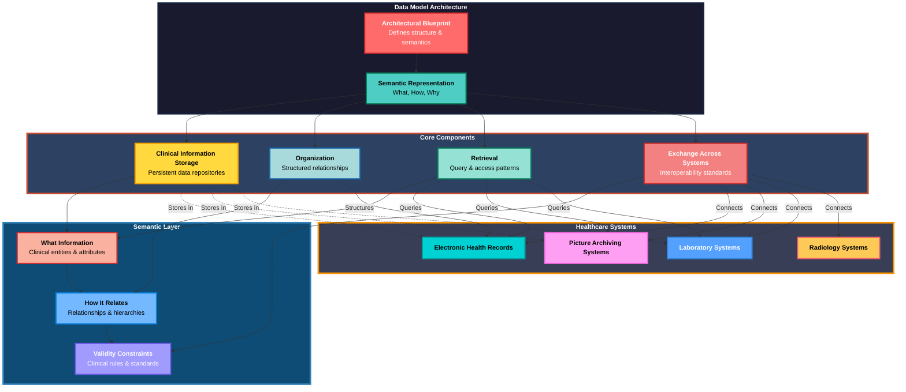

### Data Model Architecture

### Step-by-Step Diagram Description

1. **Data Model Architecture Foundation:** At the top level, the diagram establishes the foundational concept that a data model serves as an architectural blueprint, defining both structure and semantics of healthcare information systems.
2. **Semantic Representation Layer:** The blueprint flows into semantic representation, which answers three critical questions: What information matters, How it relates to other data, and Why certain constraints exist.
3. **Core Components:** The semantic layer branches into four essential functions: Storage (persistent repositories), Organization (structured relationships), Retrieval (query patterns), and Exchange (interoperability standards).
4. **Semantic Layer Details:** These core components connect to three semantic elements: What Information (clinical entities), How It Relates (relationships and hierarchies), and Validity Constraints (clinical rules ensuring data integrity).
5. **Healthcare Systems Integration:** The diagram shows how these components interact with actual healthcare systems including EHR (Electronic Health Records), PACS (Picture Archiving), LIS (Laboratory Systems), and RIS (Radiology Systems).
6. **Data Flow Patterns:** Solid arrows represent direct conceptual flows (e.g., Blueprint → Semantic → Components), while dotted lines show practical implementations (e.g., Storage stores in EHR/PACS/LIS).
7. **System Interactions:** The Exchange component connects all four healthcare systems, Organization structures the EHR, and Retrieval queries multiple systems (EHR, PACS, LIS), demonstrating the interconnected nature of healthcare IT infrastructure.
8. **Color Coding:** Each component uses distinct vivid colors to enhance visual distinction—from coral reds for blueprints to turquoise for storage, making the complex relationships easier to understand at a glance.
